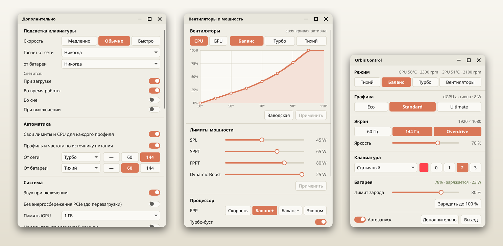
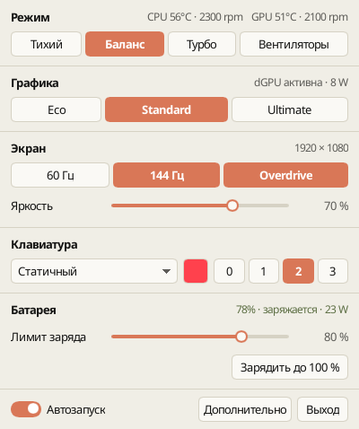
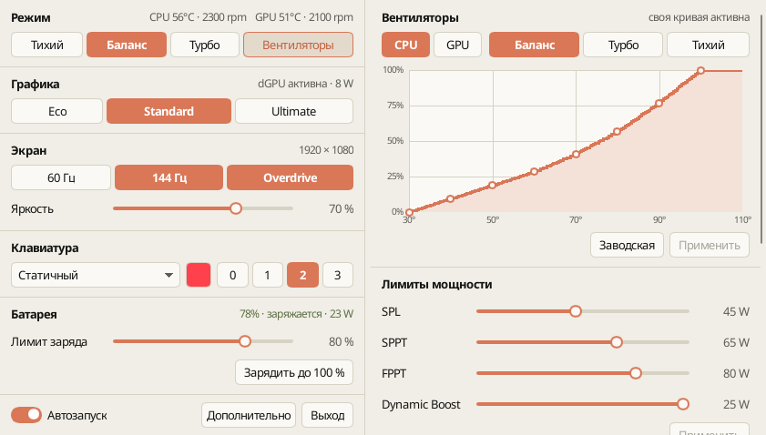
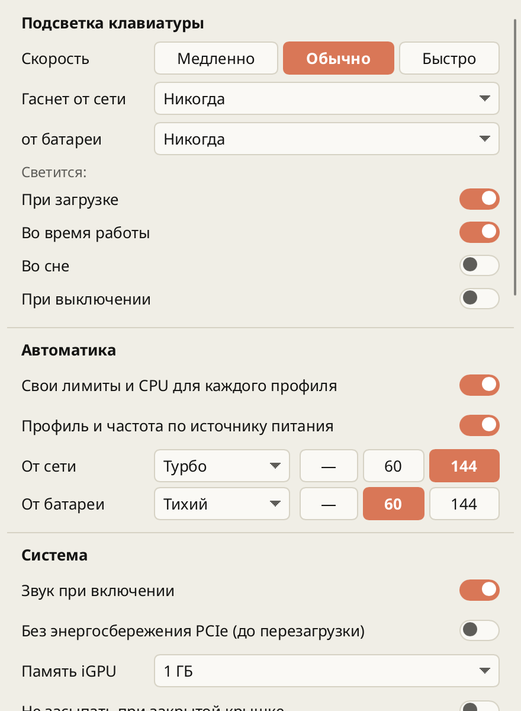

<div align="center">


# Orbis Control

**A compact control center for ASUS ROG / TUF / Zephyrus laptops on Linux**

Performance modes, fan curves, power limits, GPU modes, keyboard lighting and battery care —
in the spirit of G-Helper and ROG Control Center, native to KDE Plasma and Wayland.

[](https://github.com/arttvad9r/Orbis-control/releases/latest)
[](LICENSE)


**English** · [Русский](README.ru.md)

</div>

<picture>
  <source media="(prefers-color-scheme: dark)" srcset="screenshots/overview-dark.png">
  
</picture>

## Why Orbis Control

- **One small window for everyday things.** Mode, GPU, screen, keyboard and battery fit in a single 400-px column. Fan curves, power limits and the rest open in their own windows next to it — like G-Helper.
- **Lives in the tray.** Left click shows or hides the window right above the tray icon; right click opens a menu with profiles and Quit. Global shortcuts: <kbd>Ctrl</kbd>+<kbd>Shift</kbd>+<kbd>F5</kbd> cycles the profile, <kbd>Ctrl</kbd>+<kbd>Shift</kbd>+<kbd>F12</kbd> toggles the window, and <kbd>Fn</kbd>+<kbd>F5</kbd> is followed too.
- **Honest about your hardware.** Every control appears only when the laptop actually reports the capability, and only becomes writable when the write path is proven. A value counts as applied after it is read back, not when the request is sent.
- **Safe by design.** The GUI never runs as root. Hardware changes go through a narrow, typed D-Bus service (`orbis-hardwared`) guarded by polkit — there is no generic root shell or sysfs proxy.
- **Looks like your desktop.** Flat, quiet design in the warm Clay palette, light and dark.

## Features

| Area | What you get |
|---|---|
| **Performance** | Silent / Balanced / Turbo (through power-profiles-daemon), SPL / SPPT / FPPT, NVIDIA Dynamic Boost and GPU temperature target, AMD EPP and CPU boost — optionally remembered per profile and re-applied on every switch |
| **Fans** | Custom CPU and GPU curves for each profile: drag the points in both axes, one-click factory reset |
| **Graphics** | Eco / Standard / Ultimate with an honest reboot queue, Optimized (Eco on battery, Standard on AC), NVIDIA core / memory clock offsets |
| **Screen** | Refresh rate, brightness, Panel Overdrive |
| **Keyboard** | Brightness, Aura effects and colours, lighting per power state (boot, awake, sleep, shutdown), auto-off on idle for AC and battery separately |
| **Battery** | Charge limit, one-time full charge that restores the limit by itself, health and cycle count |
| **Automation** | Profile and refresh rate on AC / battery, mode-change notifications |
| **System** | POST sound, iGPU memory, PCIe ASPM, stay awake with the lid closed — each only when supported |
| **App** | Tray with live temperatures in the tooltip, autostart, diagnostics export, update check |

<table>
  <tr>
    <td align="center"><br><sub>Main window</sub></td>
    <td align="center"><br><sub>Fans and power</sub></td>
    <td align="center"><br><sub>Extra</sub></td>
  </tr>
</table>

> The interface is currently in Russian.

## Install

### Arch Linux (and derivatives)

Download `orbis-control-0.2.0-1-x86_64.pkg.tar.zst` from the [latest release](https://github.com/arttvad9r/Orbis-control/releases/latest), then:

```bash
sudo pacman -U orbis-control-0.2.0-1-x86_64.pkg.tar.zst
sudo systemctl enable --now orbis-hardwared.service
systemctl --user enable --now orbis-sessiond.service
```

Or build the package yourself from the pinned `PKGBUILD`:

```bash
git clone --branch v0.2.0 https://github.com/arttvad9r/Orbis-control.git
cd Orbis-control/packaging/arch
makepkg -si
```

Then start **Orbis Control** from the application menu.

### What it uses on your system

| Component | Needed for |
|---|---|
| `asusd` (asusctl) | fan curves, charge limit, keyboard backlight and Aura, GPU modes |
| `power-profiles-daemon` | Silent / Balanced / Turbo |
| `supergfxctl` | GPU mode switching on models managed by supergfxd |
| `nvidia-utils` | NVIDIA clock offsets and GPU telemetry |
| `kscreen` | refresh-rate switching on KDE Plasma |
| `ryzenadj` | AMD Curve Optimizer, on models whose firmware accepts it |

Everything is optional: whatever is missing simply does not show up.

## Hardware

Orbis Control decides what to show from what the running system reports, not from the model name, so other ASUS laptops supported by `asus-wmi` and `asusd` should get the controls they actually have. Version 0.2.0 is developed and tested only on an **ASUS TUF Gaming A17 FA707NV** (Ryzen 5 7535HS, RTX 4060) with Arch Linux / CachyOS and KDE Plasma 6 on Wayland — reports from other models are welcome.

Window placement next to the tray uses a KWin script, so it is KDE-only; on other desktops the windows open where the window manager puts them.

## Known limitations

- Some firmware rejects AMD Curve Optimizer (the FA707NV does); the control then hides itself.
- Screen gamma / colour temperature is not implemented (KWin offers no portable API besides Night Light).
- AnimeMatrix / Slash, MiniLED, XG Mobile and ASUS peripherals are not supported yet.

## How it works

```text
UPower · kernel · asusd · supergfxd · power-profiles-daemon · KWin
        │ read                                    ▲ write (polkit, read-back)
        ▼                                         │
 orbis-sessiond (user session)          orbis-hardwared (system, typed Hardware1 API)
        │                                         ▲
        └──────────────►  orbis-control (GUI, unprivileged)  ──┘
```

- the GUI is an ordinary user-session application;
- requested, observed and pending state stay distinct, and "accepted" is not "applied";
- a write whose outcome is unknown is never retried blindly.

More in [`docs/architecture.md`](docs/architecture.md) and the ADRs in [`docs/adr/`](docs/adr/).

## Development

Rust 2024 edition, toolchain 1.88 (selected by `rust-toolchain.toml`). On Arch:

```bash
sudo pacman -S --needed base-devel rustup pkgconf fontconfig freetype2 libglvnd \
  libx11 libxcursor libxrandr libxi libxkbcommon libxkbcommon-x11 \
  wayland wayland-protocols dbus openssl systemd polkit upower
cargo run -p orbis-ui --bin orbis-control      # run the GUI
scripts/verify task                             # fmt + check + tests + clippy
ORBIS_ROOT_CMD=sudo bash packaging/install-arch.sh   # local install under /usr/local
scripts/update-ui-screenshots.sh                # refresh these screenshots
```

The local install lives under `/usr/local` and shadows the package; remove it with `bash packaging/install-arch.sh --uninstall` before installing the package. The work queue is [`PLAN.md`](PLAN.md); rules for AI agents are in [`AGENTS.md`](AGENTS.md).

## License

GPL-3.0-or-later. Orbis Control is an independent project and is not affiliated with ASUSTeK Computer Inc.
