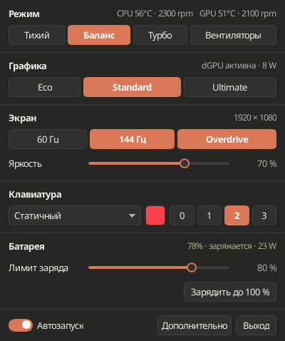
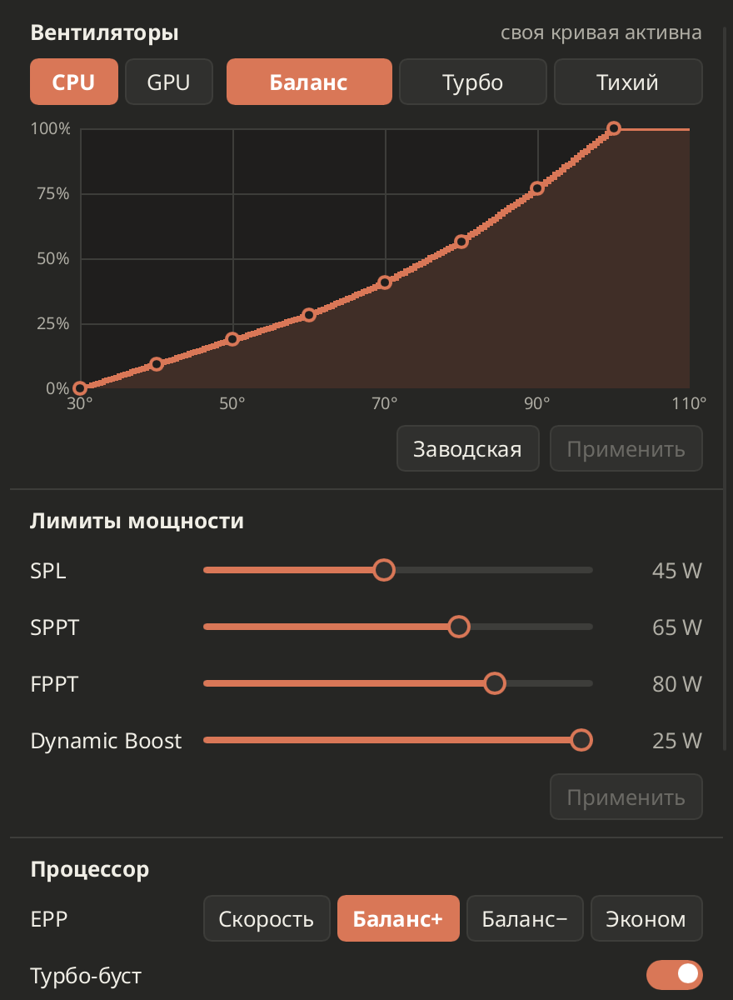
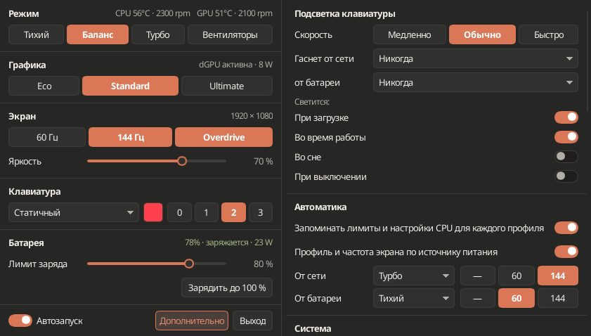

<div align="center">


# Orbis Control

**Компактный центр управления ноутбуками ASUS ROG / TUF / Zephyrus для Linux**

Режимы производительности, кривые вентиляторов, лимиты мощности, режимы GPU, подсветка клавиатуры и забота о батарее —
в духе G-Helper и ROG Control Center, родное для KDE Plasma и Wayland.

[](https://github.com/arttvad9r/Orbis-control/releases/latest)
[](LICENSE)


[English](README.md) · **Русский**

</div>

<picture>
  <source media="(prefers-color-scheme: dark)" srcset="screenshots/overview-dark.png">
  
</picture>

## Зачем

- **Одно маленькое окно для повседневного.** Режим, графика, экран, клавиатура и батарея — в одной колонке шириной 400 px. Кривые вентиляторов, лимиты мощности и всё остальное открываются отдельными окнами рядом, как в G-Helper.
- **Живёт в трее.** Левый клик показывает и прячет окно прямо над значком, правый — меню с профилями и выходом. Глобальные клавиши: <kbd>Ctrl</kbd>+<kbd>Shift</kbd>+<kbd>F5</kbd> — следующий профиль, <kbd>Ctrl</kbd>+<kbd>Shift</kbd>+<kbd>F12</kbd> — показать или скрыть окно; <kbd>Fn</kbd>+<kbd>F5</kbd> тоже отслеживается.
- **Честно про железо.** Контрол появляется, только если ноутбук действительно сообщает о возможности, и становится изменяемым, только когда путь записи подтверждён. Значение считается применённым после чтения обратно, а не после отправки запроса.
- **Безопасно по устройству.** Интерфейс никогда не работает от root. Изменения железа идут через узкую типизированную D-Bus-службу `orbis-hardwared` под защитой polkit — никакого общего root-шелла или прокси к sysfs.
- **Выглядит как рабочий стол.** Плоский спокойный дизайн в тёплой палитре Clay, светлая и тёмная тема.

## Возможности

| Раздел | Что есть |
|---|---|
| **Производительность** | Тихий / Баланс / Турбо (через power-profiles-daemon), SPL / SPPT / FPPT, NVIDIA Dynamic Boost и целевая температура GPU, EPP и турбо-буст AMD — по желанию запоминаются для каждого профиля и применяются при переключении |
| **Вентиляторы** | Свои кривые CPU и GPU для каждого профиля: точки двигаются по обеим осям, сброс на заводские в один клик |
| **Графика** | Eco / Standard / Ultimate с честной очередью до перезагрузки, Optimized (Eco от батареи, Standard от сети), смещения частот ядра и памяти NVIDIA |
| **Экран** | Частота обновления, яркость, Panel Overdrive |
| **Клавиатура** | Яркость, эффекты и цвета Aura, подсветка по состояниям (загрузка, работа, сон, выключение), автоотключение при бездействии отдельно от сети и батареи |
| **Батарея** | Лимит заряда, разовая зарядка до 100 % с автоматическим возвратом лимита, здоровье и число циклов |
| **Автоматика** | Профиль и частота экрана при работе от сети и от батареи, уведомления о смене режима |
| **Система** | Звук POST, память iGPU, PCIe ASPM, работа с закрытой крышкой — каждое только при поддержке |
| **Приложение** | Трей с температурами в подсказке, автозапуск, экспорт диагностики, проверка обновлений |

<table>
  <tr>
    <td align="center"><br><sub>Главное окно</sub></td>
    <td align="center"><br><sub>Вентиляторы и мощность</sub></td>
    <td align="center"><br><sub>Дополнительно</sub></td>
  </tr>
</table>

## Установка

### Arch Linux и производные

Скачайте `orbis-control-0.2.0-1-x86_64.pkg.tar.zst` из [последнего релиза](https://github.com/arttvad9r/Orbis-control/releases/latest) и выполните:

```bash
sudo pacman -U orbis-control-0.2.0-1-x86_64.pkg.tar.zst
sudo systemctl enable --now orbis-hardwared.service
systemctl --user enable --now orbis-sessiond.service
```

Или соберите пакет сами по закреплённому `PKGBUILD`:

```bash
git clone --branch v0.2.0 https://github.com/arttvad9r/Orbis-control.git
cd Orbis-control/packaging/arch
makepkg -si
```

Затем запустите **Orbis Control** из меню приложений.

### Что используется в системе

| Компонент | Для чего |
|---|---|
| `asusd` (asusctl) | кривые вентиляторов, лимит заряда, подсветка и Aura, режимы GPU |
| `power-profiles-daemon` | Тихий / Баланс / Турбо |
| `supergfxctl` | переключение GPU на моделях под управлением supergfxd |
| `nvidia-utils` | смещения частот NVIDIA и телеметрия GPU |
| `kscreen` | смена частоты экрана в KDE Plasma |
| `ryzenadj` | AMD Curve Optimizer на моделях, чья прошивка его принимает |

Всё необязательно: чего нет — того просто не видно.

## Железо

Orbis Control решает, что показывать, по тому, что сообщает работающая система, а не по названию модели. Поэтому другие ноутбуки ASUS, которые поддерживают `asus-wmi` и `asusd`, должны получить ровно те контролы, что у них есть. Версия 0.2.0 разрабатывается и проверяется только на **ASUS TUF Gaming A17 FA707NV** (Ryzen 5 7535HS, RTX 4060) с Arch Linux / CachyOS и KDE Plasma 6 на Wayland — отчёты с других моделей приветствуются.

Расстановка окон рядом с треем сделана через скрипт KWin и работает только в KDE; в других окружениях окна открываются там, где их поставит оконный менеджер.

## Известные ограничения

- Некоторые прошивки не принимают AMD Curve Optimizer (FA707NV — в их числе); тогда контрол скрывается.
- Гамма и цветовая температура экрана не реализованы: у KWin нет переносимого API, кроме Night Light.
- AnimeMatrix / Slash, MiniLED, XG Mobile и периферия ASUS пока не поддерживаются.

## Как устроено

```text
UPower · ядро · asusd · supergfxd · power-profiles-daemon · KWin
        │ чтение                                   ▲ запись (polkit, чтение обратно)
        ▼                                          │
 orbis-sessiond (сессия пользователя)    orbis-hardwared (система, типизированный API Hardware1)
        │                                          ▲
        └──────────────►  orbis-control (интерфейс, без привилегий)  ──┘
```

- интерфейс — обычное приложение пользовательской сессии;
- запрошенное, наблюдаемое и ожидающее состояния не смешиваются, «принято» — не значит «применено»;
- запись с неизвестным исходом никогда не повторяется вслепую.

Подробнее — в [`docs/architecture.md`](docs/architecture.md) и ADR в [`docs/adr/`](docs/adr/).

## Разработка

Rust 2024, toolchain 1.88 (выбирается через `rust-toolchain.toml`). На Arch:

```bash
sudo pacman -S --needed base-devel rustup pkgconf fontconfig freetype2 libglvnd \
  libx11 libxcursor libxrandr libxi libxkbcommon libxkbcommon-x11 \
  wayland wayland-protocols dbus openssl systemd polkit upower
cargo run -p orbis-ui --bin orbis-control      # запустить интерфейс
scripts/verify task                             # fmt + check + тесты + clippy
ORBIS_ROOT_CMD=sudo bash packaging/install-arch.sh   # локальная установка в /usr/local
scripts/update-ui-screenshots.sh                # обновить эти скриншоты
```

Локальная установка живёт в `/usr/local` и перекрывает пакет; удалите её командой `bash packaging/install-arch.sh --uninstall` перед установкой пакета. Очередь работ — [`PLAN.md`](PLAN.md), правила для ИИ-агентов — [`AGENTS.md`](AGENTS.md).

## Лицензия

GPL-3.0-or-later. Orbis Control — независимый проект, не связанный с ASUSTeK Computer Inc.
